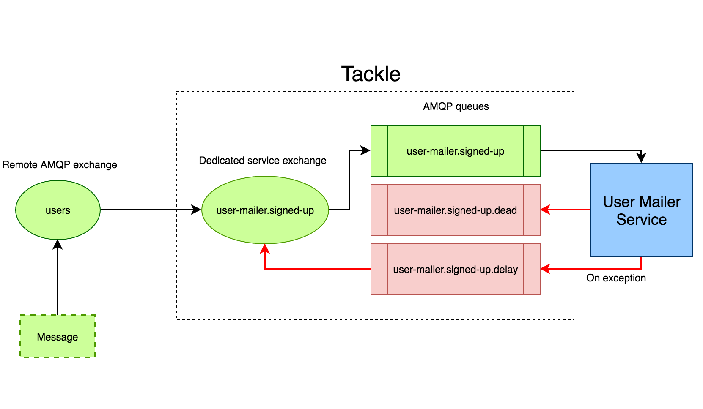

# Tackle

[](https://semaphoreci.com/renderedtext/tackle)

Tackles the problem of processing asynchronous jobs in reliable manner
by relying on RabbitMQ.

Tackle is only a thin wrapper around raw RabbitMQ based communication.

You should also take a look at [Elixir Tackle](https://github.com/renderedtext/ex-tackle).

## Why should I use tackle

- It is ideal for fast microservice prototyping
- It uses sane defaults for queue and exchange creation
- It retries messages that fail to be processed
- It stores unprocessed messages into a __dead__ queue for later inspection

## Installation

Add this line to your application's Gemfile:

```ruby
gem "rt-tackle", :require => "tackle"
```

## Usage

### Publishing a message

With tackle, you can publish a message to an AMQP exchange. For example, to
publish `"Hello World!"` do the following:

```ruby
options = {
  :url => "amqp://localhost",
  :exchange => "test-exchange",
  :routing_key => "test-messages",
}

Tackle.publish("Hello World!", options)
```

Optionally, you can pass a dedicated logger to the publish method. This comes
handy if you want to log the status of your publish action to a file.

```ruby
options = {
  :url => "amqp://localhost",
  :exchange => "test-exchange",
  :routing_key => "test-messages",
  :logger => Logger.new("publish.log")
}

Tackle.publish("Hello World!", options)
```

### Consume messages

Tackle enables you to connect to an AMQP exchange and consume messages from it.

```ruby
require "tackle"

options = {
  :url => "amqp://localhost",
  :exchange => "users",
  :routing_key => "signed-up",
  :service => "user-mailer",
  :exception_handler => lambda { |ex, consumer| puts ex.message }
}

Tackle.consume(options) do |message|
  puts message
end
```

The above code snippet creates the following AMQP resources:

1. A dedicated exchange for your service, in this example `user-mailer.signed-up`
2. Connects your dedicated `user-mailer.signed-up` exchange to the remote
   exchange from which you want to consume messages, in this example `users`
   exchange
3. Creates an AMQP queue `user-mailer.signed-up` and connects it to your local
   exchange
4. Creates a delay queue `user-mailer.signed-up.delay`. If your service raises
   an exception while processing an incoming message, tackle will put it in this
   this queue, wait for a while, and then republish to the
   `user-mailer.signed-up` exchange.
5. Creates a dead queue `user-mailer.signed-up.dead`. After several retries
   where your service can't consume the message, tackle will store them in a
   dedicated dead queue. You can consume this messages manually.



You can pass additional configuration to tackle in order to control the number
of retries, and the delay between each retry.

```ruby
require "tackle"

options = {
  :url => "amqp://localhost",
  :exchange => "users",
  :routing_key => "signed-up"
  :service => "user-mailer",
  :retry_limit => 8,
  :retry_delay => 30,
  :exception_handler => lambda { |ex, consumer| puts ex.message }
}

Tackle.consume(options) do |message|
  puts message
end
```

By default, tackle logs helpful information to the `STDOUT`. To redirect these
messages to a file, pass a dedicated logger to tackle.

```ruby
require "tackle"

options = {
  :url => "amqp://localhost",
  :exchange => "users",
  :routing_key => "signed-up"
  :service => "user-mailer",
  :retry_limit => 8,
  :retry_delay => 30,
  :logger => Logger.new("consumer.log"),
  :exception_handler => lambda { |ex, consumer| puts ex.message }
}

Tackle.consume(options) do |message|
  puts message
end
```

## Development

After checking out the repo, run `bin/setup` to install dependencies. Then,
run `rake rspec` to run the tests. You can also run `bin/console` for an
interactive prompt that will allow you to experiment.

To install this gem onto your local machine, run `bundle exec rake install`.
To release a new version, update the version number in `version.rb`, and
then run `bundle exec rake release`, which will create a git tag for the
version, push git commits and tags, and push the `.gem` file
to [rubygems.org](https://rubygems.org).

## Contributing

Bug reports and pull requests are welcome on GitHub at
https://github.com/renderedtext/tackle.
